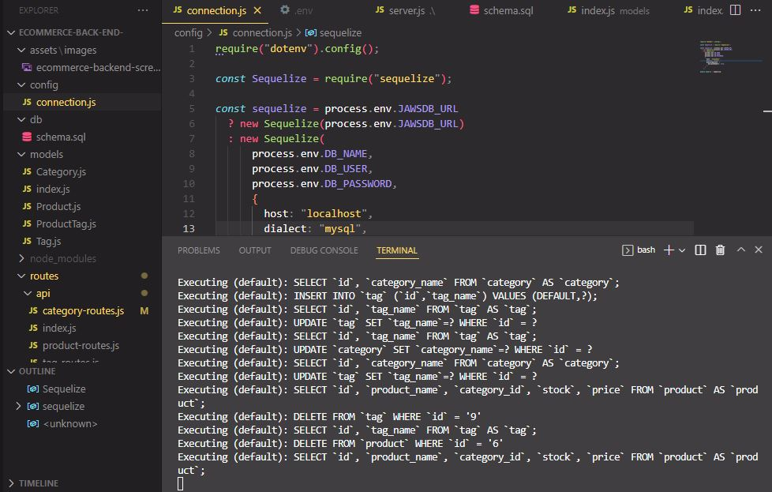

# Ecommerce-Back-End 

A SQL Based Employee Tracker using CLI Input, Node.js Express and Inquirer to manipulate a MySQL database.

# Description

A sequelize ORM model database application that houses information on an ecommerce platfom, including category, product, and tag information and the relationships between the products. Implemented with Node.js and Express.js, Sequelize commands manipulating a MySQL database.

# Screenshot of sequelize interface input & file structure:

# Link to Screengrab video of application in operation:

https://drive.google.com/file/d/1xVuXpTgZjEigsaAn4zQiqXePadHhY54f/view

# Link to GitHub repository:

https://github.com/mdschenck/Ecommerce-Back-End-

# User Story:

- AS A manager at an internet retail company
- I WANT a back end for my e-commerce website that uses the latest technologies
- SO THAT my company can compete with other e-commerce companies

# Acceptance Criteria:

- GIVEN a functional Express.js API
- WHEN I add my database name, MySQL username, and MySQL password to an environment variable file
- THEN I am able to connect to a database using Sequelize
- WHEN I enter schema and seed commands
- THEN a development database is created and is seeded with test data
- WHEN I enter the command to invoke the application
- THEN my server is started and the Sequelize models are synced to the MySQL database
- WHEN I open API GET routes in Insomnia for categories, products, or tags
- THEN the data for each of these routes is displayed in a formatted JSON
- WHEN I test API POST, PUT, and DELETE routes in Insomnia
- THEN I am able to successfully create, update, and delete data in my database

# License:

MIT License https://opensource.org/licenses/MIT

# Questions:

For any questions please email mdschenck@gmail.com
